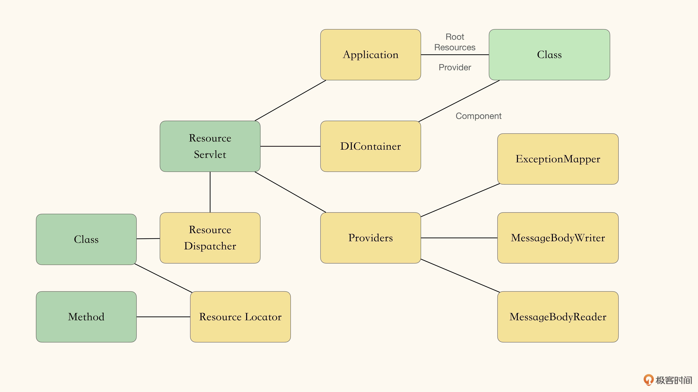

初步 spike 的内容：
1. 可处理HTTP请求的某个 Resource 资源。
2. 可通过 MessageBodyWriter 扩展点，将内容写入 HTTP 响应中。

清楚了 Servlet 如何使用 Application 和 Providers；
清楚了需要在什么地方使用 DI 注入容器。  

初步 spike 之后，得到了一个较为清晰的架构愿景：  

但是，JAX-RS 里有 2 中依赖注入： 
1. Application Scope 的 Inject 注入
2. Request Scope 的 Context 注入
这部分的架构愿景现在仍是不清晰的，需要进一步 Spike。
