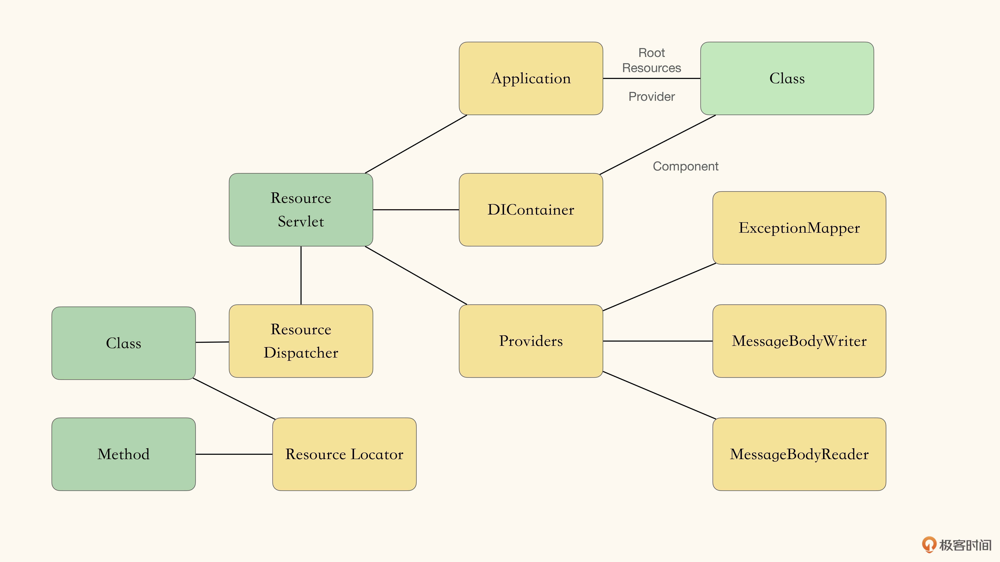
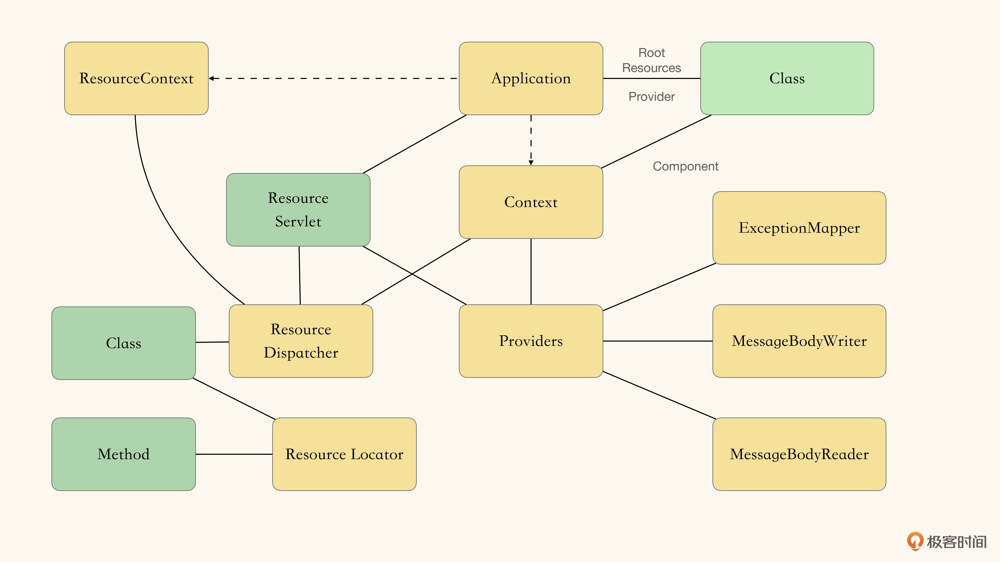
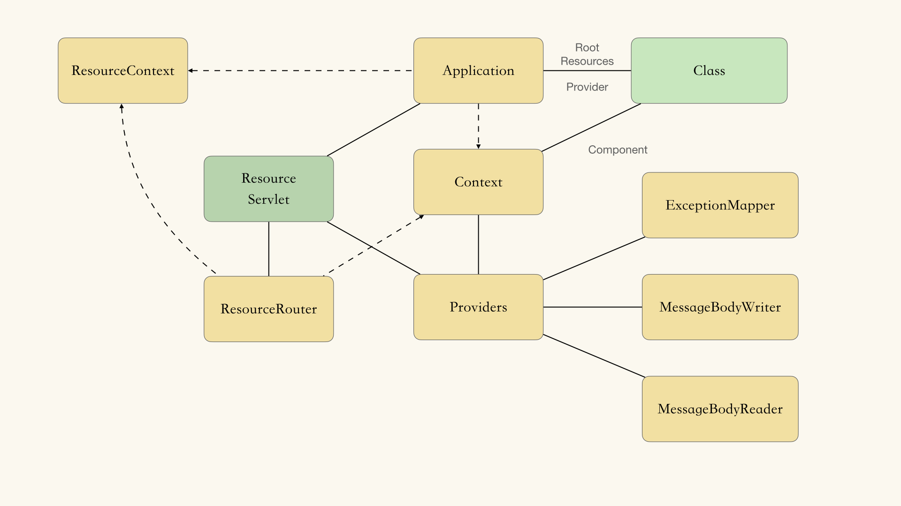
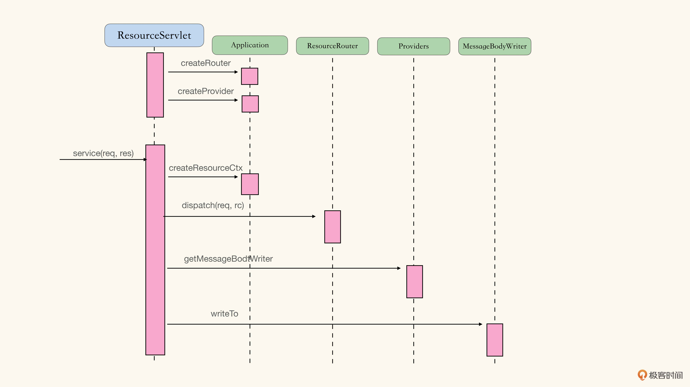
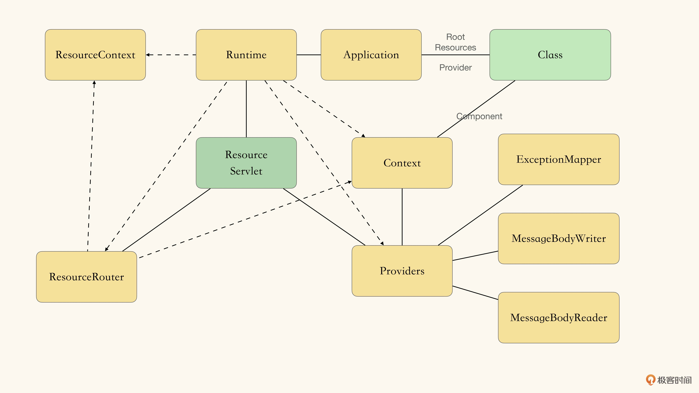
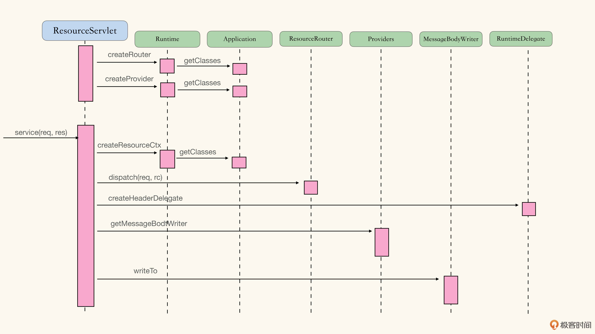
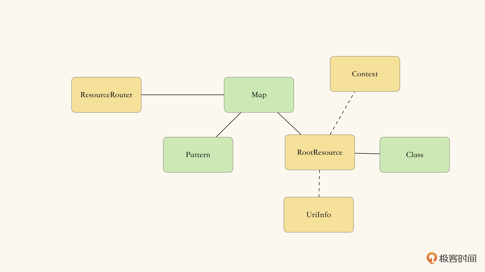
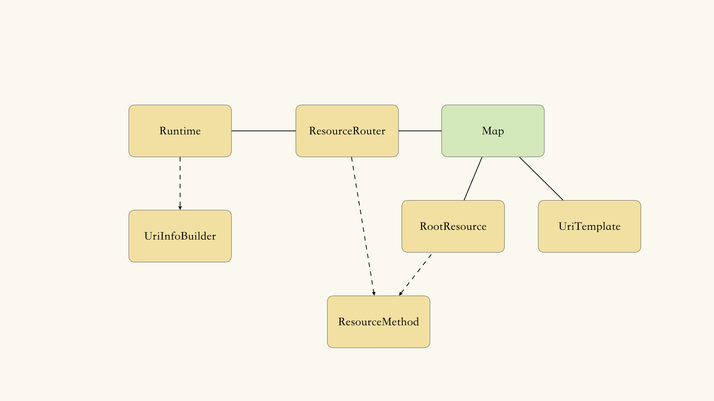
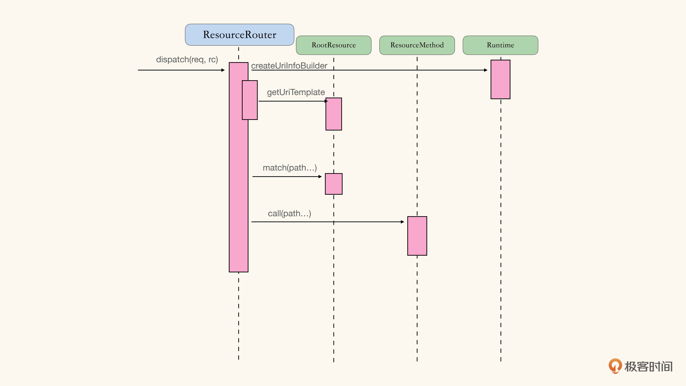

### Spike 
spike： 并不是把所有细节都理解完，目的是花最小的成本，搞懂各个接口之间的交互方式，得到一个清晰的组件架构愿景。

初步 spike 的内容：
1. 可处理HTTP请求的某个 Resource 资源。
2. 可通过 MessageBodyWriter 扩展点，将内容写入 HTTP 响应中。

清楚了 Servlet 如何使用 Application 和 Providers；
清楚了需要在什么地方使用 DI 注入容器。  

初步 spike 之后，得到了一个较为清晰的架构愿景：  

但是，JAX-RS 里有 2 中依赖注入： 
1. Application Scope 的 Inject 注入
2. Request Scope 的 Context 注入
这部分的架构愿景现在仍是不清晰的，需要进一步 Spike。

然后得到了架构愿景：

之后，需要 Spike 下 Resource Dispatcher 的部分。
然后进一步得到了架构愿景和调用栈顺序：

得到了以下的明确信息：
- ResourceServlet：以 Servlet 的形式作为入口，处理 Http 请求。
- Application：指明 RESTful 应用所需的所有组件，比如 Root Resource、Providers 等，也是对于框架提供的服务的访问入口。
- ResourceRouter：Http 请求派发算法的实现载体。
- Providers：三个扩展点，也就是 MessageBodyWriter，MessageBodyReader 以及 ExceptionMapper。

### 任务列表
按照划分的组件，重组功能列表：
- ResourceServlet
  - 将请求派分给对应的资源（Resource），并根据返回的状态、超媒体类型、内容，响应 Http 请求
  - 当资源方法抛出异常时，根据异常影响 Http 请求
- ResourceRouter
  - 将请求派分给对应的资源（Resource），并根据返回的状态、超媒体类型、内容，响应 Http 请求
  - 在处理请求派分时，可以支持多级子资源（Sub-Resource）
  - 在处理请求派分时，可以根据客户端提供的超媒体类型，选择对应的资源方法（Resource Method）
  - 在处理请求派分时，可以根据客户端提供的 Http 方法，选择对应的资源方法
  - 资源方法可以返回 Java 对象，由 Runtime 自行推断正确的返回状态
  - 资源方法可以不明确指定返回的超媒体类型，由 Runtime 自行推断，比如，资源方法标注了 Produces，那么就使用标注提供的超媒体类型等
  - 资源方法可按照期望的类型，访问 Http 请求的内容
  - 资源对象和资源方法可接受环境组件的注入
- Providers
  - 可通过扩展点 MessageBodyWriter 处理不同类型的返回内容
  - 可通过扩展点 ExceptionMapper 处理不同类型的异常
- ResourceContext
  - 资源对象和资源方法可接受环境组件的注入

采用伦敦学派时，按照调用栈顺序由外向内地实现不同的组件。  
首先实现 ResourceServlet，细化功能列表：
- ResourceServlet
  - 将请求派分给对应的资源（Resource），并根据返回的状态、超媒体类型、内容，响应 Http 请求
    - 使用 OutboundResponse 的 status 作为 Http Response 的状态；
    - 使用 OutboundResponse 的 headers 作为 Http Response 的 Http Headers；
    - 通过 MessageBodyWriter 将 OutboundResponse 的 GenericEntity 写回为 Body；
    - 如果找不到对应的 MessageBodyWriter，则返回 500 族错误
    - 如果找不到对应的 HeaderDelegate，则返回 500 族错误
    - 如果找不到对应的 ExceptionMapper，则返回 500 族错误
    - 如果 entity 为空，则忽略 body
  - 当资源方法抛出异常时，根据异常影响 Http 请求
    - 如果抛出 WebApplicationException，且 response 不为 null，则使用 response 响应 Http
    - 如果抛出的不是 WebApplicationException，则通过异常的具体类型查找 ExceptionMapper，生产 response 响应 Http 请求

  
在写 com.kuan.rest.ResourceServletTest.should_use_http_headers_from_response 测试时，新增了一个 RuntimeDelegate 扩展点，所以架构愿景会发生改变，如下：

任务列表也会新增，针对 RuntimeDelegate 组件的任务列表如下：
- RuntimeDelegate
  - 为 MediaType 提供 HeaderDelegate
  - 为 CacheControl 提供 HeaderDelegate
  - 为 Cookie 提供 HeaderDelegates
  - 为 EntityTag 提供 HeaderDelegate
  - 为 Link 提供 HeaderDelegate
  - 为 NewCookie 提供 HeaderDelegate
  - 为 Date 提供 HeaderDelegate

再驱动完了 ResourceServlet 组件的开发之后，需要把抽象层中其他使用到的组件，也加入到任务列表中：
- RuntimeDelegate
  - 为 MediaType 提供 HeaderDelegate
  - 为 CacheControl 提供 HeaderDelegate
  - 为 Cookie 提供 HeaderDelegates
  - 为 EntityTag 提供 HeaderDelegate
  - 为 Link 提供 HeaderDelegate
  - 为 NewCookie 提供 HeaderDelegate
  - 为 Date 提供 HeaderDelegate
  - 提供 OutboundResponseBuilder
- OutboundResponseBuilder
  - 可按照不同的 Status 生成 Resposne
- OutboundResponse
- Resource Dispatcher
  - 将 Reosurce Method 的返回值包装为 Response 对象
- Providers
  - 可获取 MessageBodyWriter
  - 可获取 ExceptionMapper
- Runtimes
  - 可获取 ResoruceDispatcher
  - 可获取 Providers
- MessageBodyWriter
- ExceptionMapper
  - 需要提供默认的 ExceptionMapper

接下来，对于确定怎么交互（调用栈）的部分，可以进入经典模式，拆解任务列表继续开发。
但对于 Resource Dispatcher 的部分，具体怎么交互的仍然不确定，可通过 Spike 消除这种不确定性。

对于 Resource Dispatcher 的部分，一个简单的架构构想如下：

1. 将所有的 RootResource 的 Path 转化为正则表达式的 Pattern；
2. ResourceRouter 拿到 HttpServletRequest 之后，尝试与 Pattern 匹配；
3. 匹配到的 RootResource 通过 Context 实例化；
4. 调用实例化后的 RootResource，处理请求，过程中把中间信息存入 UriInfo；
5. ResourceRouter 拿到结果后，转化为 Response 对象返回。

--- 

在对 Resource Dispatch 部分、SubResource 部分进行了 Spike 之后，架构愿景如下：

据此，原本设计的 ResourceRouter将 需求，分解到 Resource/RootResoruce/ResoutceMethod 模块中。  
所得结果如下：
- ResourceRouter
  - 将 Reosurce Method 的返回值包装为 Response 对象
    - 根据与 Path 匹配结果，降序排列 RootResource，选择第一个的 RootResource
    - 如果没有匹配的 RootResource，则构造 404 的 Response
    - 如果返回的 RootResource 中无法匹配剩余 Path，则构造 404 的 Response
    - 如果 ResourceMethod 返回 null，则构造 204 的 Response
- Resource/RootResource/ResourceMethod
  - 在处理请求派分时，可以支持多级子资源（Sub-Resource）
  - 在处理请求派分时，可以根据客户端提供的超媒体类型，选择对应的资源方法（Resource Method）
  - 在处理请求派分时，可以根据客户端提供的 Http 方法，选择对应的资源方法
  - 资源方法可以返回 Java 对象，由 Runtime 自行推断正确的返回状态
  - 资源方法可以不明确指定返回的超媒体类型，由 Runtime 自行推断，比如，资源方法标注了 Produces 标注，那么就使用标注提供的超媒体类型等
  - 资源方法可按找期望的类型，访问 Http 请求的内容
  - 资源对象和资源方法可接受环境组件的注入

--- 
至此（参考 git commit 顺序），完成了 ResourceRouter 的基本功能，沿着调用栈顺序，该进入到 RootResource/Resource/ResourceMethod 的开发中。  
而在当前的架构愿景下，RootResource/Resource/ResourceMethod 都需要使用 UriTemplate、UriInfoBuilder 作为支撑。  

在这里，UriTemplate 的开发是可以使用经典学派的做法往下走的。 对 UriTemplate 进一步 Spike，细化之后的任务列表：
- UriTemplate
  - 匹配无参数的 Uri 模版
    - 如果 Uri 可以与模版匹配，则返回匹配结果
    - 如果 Uri 不能与模版匹配，则返回 Optional.empty
  - 匹配带参数的 Uri 模版
    - 如果 Uri 可以与模版匹配，按照指定参数从 Uri 中提取值
    - 参数可以通过正则表达式指定格式
    - 如果参数重复定义，则抛出异常
  - 模版匹配的结果可以比较大小
    - 如果匹配的非参字符多，则优先（长的优先）
    - 如果匹配的非参数字符一样，匹配的分组多，则优先（参数优先）
    - 如果匹配的分组一样多，指定格式参数匹配多的优先（指定格式参数优先）

---
UriTemplate 完成了任务列表的开发后，细化一下 RootResource/Resource/ResourceMethod 的任务列表继续开发：  
首先关注在请求派分的 Uri 匹配部分：
- Resource/RootResource/ResourceMethod
  - 从 Path 标注中获取 UriTemplate
    - 如不存在 Path 标注，则抛出异常
  - 在处理请求派分时，可以根据客户端提供的 Http 方法，选择对应的资源方法
    - 当请求与资源方法的 Uri 模版一致，且 Http 方法一致时，派分到该方法
    - 没有资源方法于请求的 Uri 和 Http 方法一致时，返回 404
  - 在处理请求派分时，可以支持多级子资源
    - 当没有资源方法可以匹配请求时，选择最优匹配 SubResourceLocator，通过它继续进行派分
    - 如果 SubResourceLocator 也无法找到满足的请求时，返回 404

