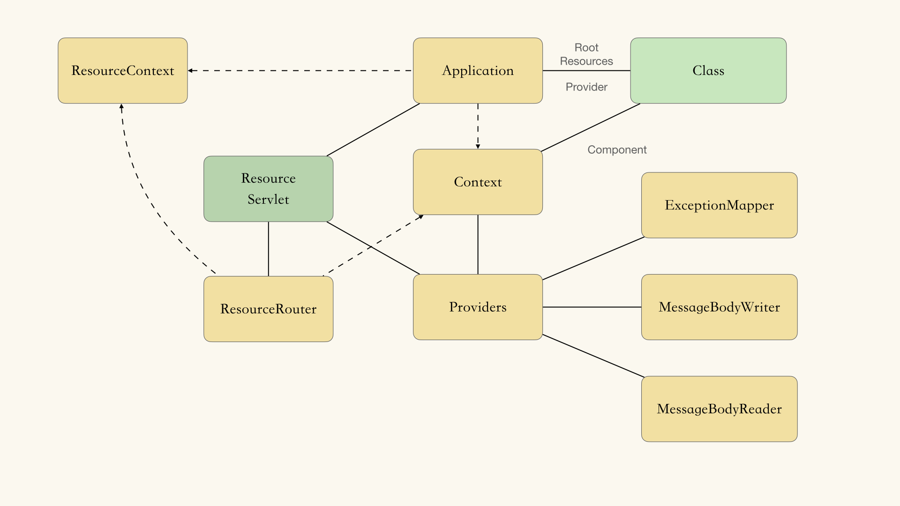
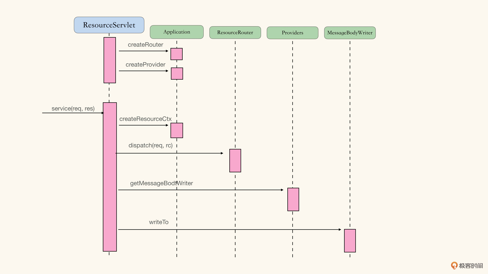

### Spike 
spike： 并不是把所有细节都理解完，目的是花最小的成本，搞懂各个接口之间的交互方式，得到一个清晰的组件架构愿景即可。

初步 spike 的内容：
1. 可处理HTTP请求的某个 Resource 资源。
2. 可通过 MessageBodyWriter 扩展点，将内容写入 HTTP 响应中。

清楚了 Servlet 如何使用 Application 和 Providers；
清楚了需要在什么地方使用 DI 注入容器。  

初步 spike 之后，得到了一个较为清晰的架构愿景：  

但是，JAX-RS 里有 2 中依赖注入： 
1. Application Scope 的 Inject 注入
2. Request Scope 的 Context 注入
这部分的架构愿景现在仍是不清晰的，需要进一步 Spike。

然后得到了架构愿景：

之后，需要 Spike 下 Resource Dispatcher 的部分。
然后进一步得到了架构愿景和调用栈顺序：

得到了以下的明确信息：
- ResourceServlet：以 Servlet 的形式作为入口，处理 Http 请求。
- Application：指明 RESTful 应用所需的所有组件，比如 Root Resource、Providers 等，也是对于框架提供的服务的访问入口。
- ResourceRouter：Http 请求派发算法的实现载体。
- Providers：三个扩展点，也就是 MessageBodyWriter，MessageBodyReader 以及 ExceptionMapper。

### 任务列表
按照划分的组件，重组功能列表：
- ResourceServlet
  - 将请求派分给对应的资源（Resource），并根据返回的状态、超媒体类型、内容，响应 Http 请求
  - 当资源方法抛出异常时，根据异常影响 Http 请求
- ResourceRouter
  - 将请求派分给对应的资源（Resource），并根据返回的状态、超媒体类型、内容，响应 Http 请求
  - 在处理请求派分时，可以支持多级子资源（Sub-Resource）
  - 在处理请求派分时，可以根据客户端提供的超媒体类型，选择对应的资源方法（Resource Method）
  - 在处理请求派分时，可以根据客户端提供的 Http 方法，选择对应的资源方法
  - 资源方法可以返回 Java 对象，由 Runtime 自行推断正确的返回状态
  - 资源方法可以不明确指定返回的超媒体类型，由 Runtime 自行推断，比如，资源方法标注了 Produces，那么就使用标注提供的超媒体类型等
  - 资源方法可按照期望的类型，访问 Http 请求的内容
  - 资源对象和资源方法可接受环境组件的注入
- Providers
  - 可通过扩展点 MessageBodyWriter 处理不同类型的返回内容
  - 可通过扩展点 ExceptionMapper 处理不同类型的异常
- ResourceContext
  - 资源对象和资源方法可接受环境组件的注入

采用伦敦学派时，按照调用栈顺序由外向内地实现不同的组件。  
首先实现 ResourceServlet，细化功能列表：
- ResourceServlet
  - 将请求派分给对应的资源（Resource），并根据返回的状态、超媒体类型、内容，响应 Http 请求
  - 使用 OutboundResponse 的 status 作为 Http Response 的状态；
  - 使用 OutboundResponse 的 headers 作为 Http Response 的 Http Headers；
  - 通过 MessageBodyWriter 将 OutboundResponse 的 GenericEntity 写回为 Body；
  - 如果找不到对应的 MessageBodyWriter，则返回 500 族错误
  - 当资源方法抛出异常时，根据异常影响 Http 请求
  - 如果抛出 WebApplicationException，且 response 不为 null，则使用 response 响应 Http
  - 如果抛出 WebApplicationException，而 response 为 null，则通过异常的具体类型查找 ExceptionMapper，生产 response 响应 Http 请求
  - 如果抛出的不是 WebApplicationException，则通过异常的具体类型查找 ExceptionMapper，生产 response 响应 Http 请求