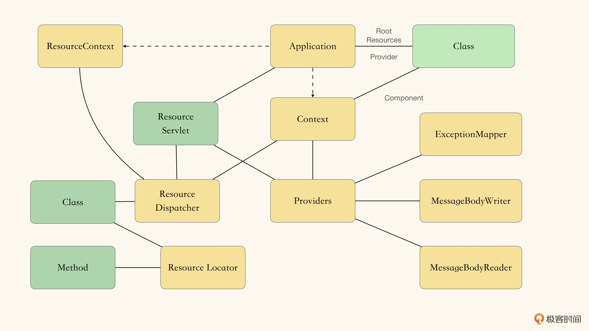

spike： 并不是把所有细节都理解完，目的是花最小的成本，搞懂各个接口之间的交互方式，得到一个清晰的组件架构愿景即可。

初步 spike 的内容：
1. 可处理HTTP请求的某个 Resource 资源。
2. 可通过 MessageBodyWriter 扩展点，将内容写入 HTTP 响应中。

清楚了 Servlet 如何使用 Application 和 Providers；
清楚了需要在什么地方使用 DI 注入容器。  

初步 spike 之后，得到了一个较为清晰的架构愿景：  

但是，JAX-RS 里有 2 中依赖注入： 
1. Application Scope 的 Inject 注入
2. Request Scope 的 Context 注入
这部分的架构愿景现在仍是不清晰的，需要进一步 Spike。

然后得到了架构愿景：

之后，需要 Spike 下 Resource Dispatcher 的部分。
